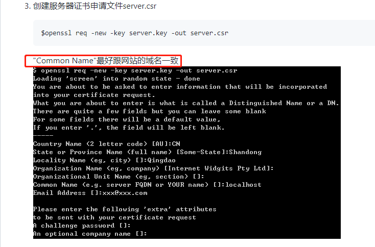

## 原理

##### 闲鱼搜慕课icode

docker镜像本质是一堆文件的集合，既然是文件，那就可以直接访问。
docker inspect <镜像名> 可以看到镜像文件存放的位置

通过docker history --no-trunc <镜像名> 可以分析出镜像的启动流程

分析后确定是start.sh这个脚本负责项目的启动，在镜像文件层直接find . -name start.sh脚本。脚本内容如下：


可以发现认证是通过coolenv这个二进制文件来做的

继续在镜像文件存放位置find coolenv，拿到二进制文件进行分析（具体分析过程Baidu），发现一个疑似的api网址：https://apis.imooc.com/?cid=108&icode=%sinternal，浏览器请求发现返回一串json，把内容的乱码拿去解析发现内容为**icode不正确**。可以确定这个就是coolenv启动时请求的icode api。

既然知道了他请求的网址，那就可以在本地伪造一个fake imooc api网站，把镜像的请求截取到本地，直接返回相应内容，即可让coolenv认为认证成功。

首先要知道的是请求的这个网站是https的，而https的网站需要解决证书与认证的问题。

所以我们需要在本地生成一对根证书和服务端证书。生成证书步骤Baidu，重点是生成时需要在生成配置中，配置Common Name必须为api.imooc.com


[https://github.com/flyingtime/go-https]()

有了这一对根证书和服务端证书后，我们还需要把根证书写入镜像，并在本地启动https服务端，证书用上面生成的服务端证书。https服务端可以用go简单写一个，在go-test/server中可以找到。

根证书写入镜像比较麻烦，我的做法是在本机先写入ca文件，然后把ca文件拷贝到镜像对应目录中，具体可参考这篇文章：[https://www.cnblogs.com/jiaoyiping/p/6629442.html]()

简单来说就是在本地把根证书拷贝到/usr/local/share/ca-certificates目录，然后执行sudo update-ca-certificates，然后把自动生成的/etc/ssl/certs/ca-certificates.crt 文件拷贝到镜像/etc/ssl/certs/目录中。

做完这一切之后，镜像就变成了一个认可我们本地https服务端的镜像，现在需要做的就是把镜像对https://api.imooc.com的请求改为请求本地即可。

要做到这一点很简单，我们都知道对域名的请求都会经过dns解析，最后变成对具体ip地址的请求。最简单的做法是在/etc/hosts中添加一条指向，把请求指向docker网关，也就是本机。

我们如法炮制，进到镜像文件所在目录，find hosts文件，添加如下内容
```172.17.0.1 apis.imooc.com```
ip需要改为自己的docker网关，ip a可以看到docker网关。

到这里就完成了所有工作，启动本地的https服务端，然后启动镜像，启动命令如下：
```bash
# --add-host: 改为自己的docker的网关ip
docker run --name coolenv -p 18000:18000 --add-host apis.imooc.com:172.17.0.1 -e ICODE="xxxxxx" -e GODEBUG=x509ignoreCN=0 coolenv-bypass-icode
```

后续每次启动都需要先启动本地的https服务端。
